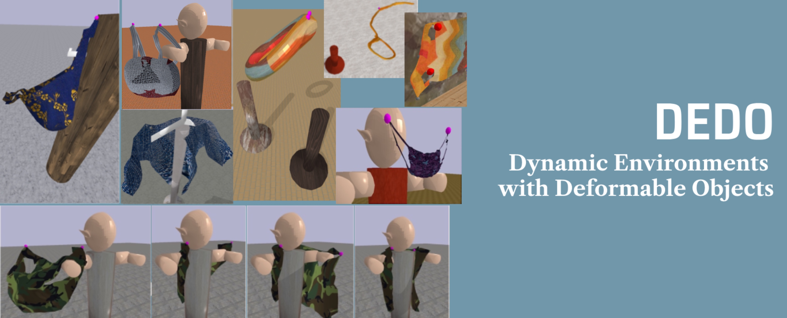

### DEDO  - Dynamic Environments with Deformable Objects
This is a personal copy of the DEDO repo.

To launch a simulation with one qnchor, using the robot **FETCH**, use:
```bash
python -m dedo.demo_preset --env=HangGarmentRobot-v1 --viz --override_deform_obj "cloth/apron_5.obj" --robot_name fetch --debug false
```